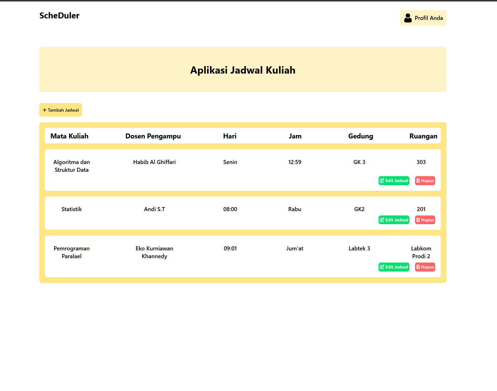
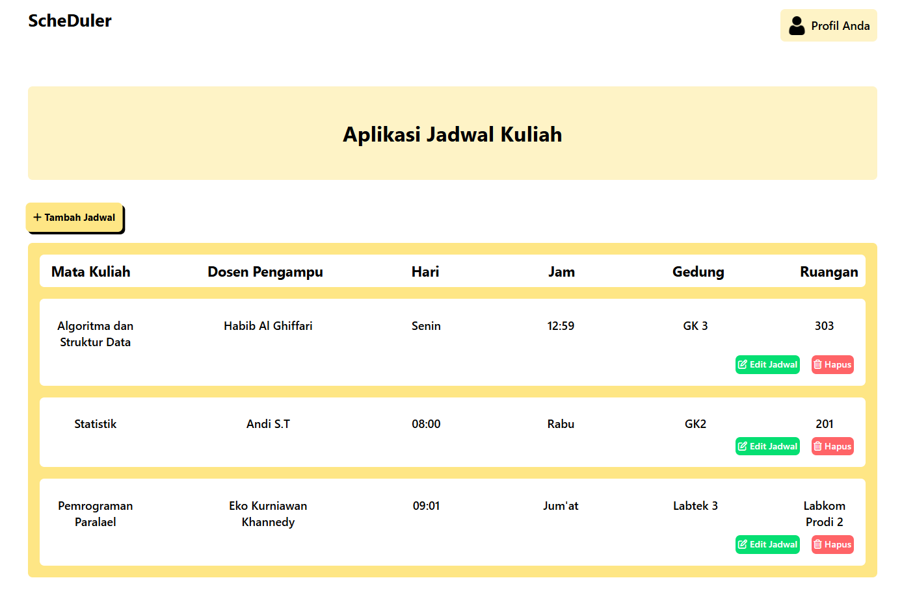
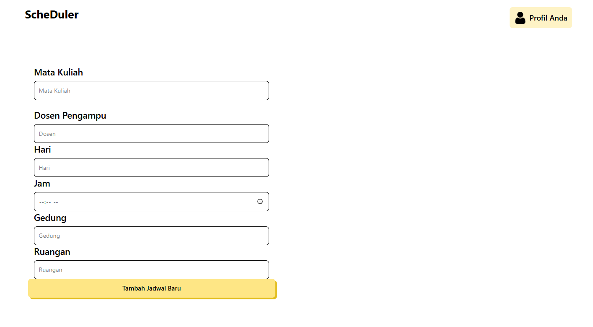
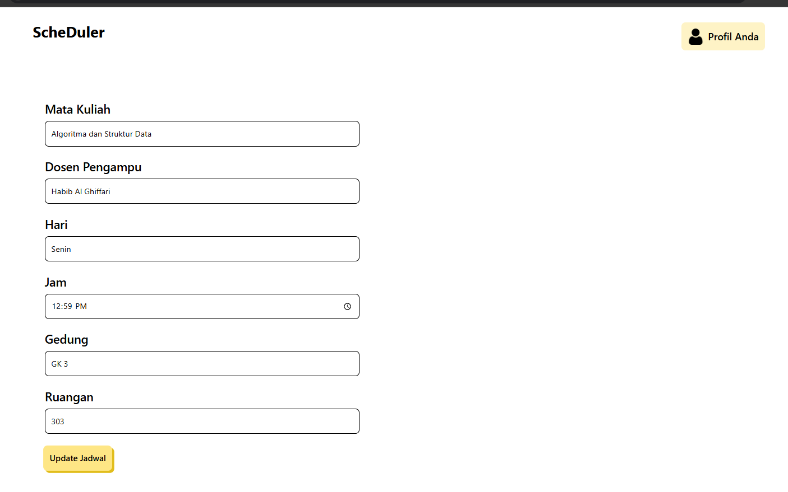

<!-- ABOUT THE PROJECT -->

## About The Project

Aplikasi web ScheDuler ini dibangun dengan tujuan membantu para mahasiswa dalam mencatat dan mengelola jadwal rutin perkuliahan mereka. Tampilan UI yang minimalis membuat aplikasi web ini mnudah untuk dipahami dan digunakan oleh pengguna baru. Melalui aplikasi ScheDuler ini, pengguna dapat menambahkan jadwal perkuliahan yang terdiri dari mata kuliah, dosen pengampu, Hari perkuliahan, Jam perkuliahan, Gedung yang digunakan, dan Ruangan yang digunakan.

Fitur-fitur dalam aplikasi ScheDuler ini antara lain :

- Menambahkan jadwal perkuliahan secara lengkap
- Menampilkan jadwal perkuliahan yang dimasukkan pengguna
- Pengguna bebas mengelola jadwal perkuliahan mereka

Melalui aplikasi ScheDuler ini, kami berharap mahasiswa tidak lagi kesulitan dalam mengelola jadwal rutin perkuliahan mereka.

### Aplikasi Web ini Dibangun Menggunakan

- 
- 
- 

<!-- GETTING STARTED -->

## Fitur ES6+ yang Diaplikasikan Dalam Aplikasi Web

- JS Asynchronous (Async Await)
- JS OOP Dengan Class
- JS Module (import)
- JS Arrow Functions

## Screenshot Aplikasi Web ScheDuler

### Halaman Beranda

### Halaman Tambah Jadwal

### Halaman Edit Jadwal

### Kontributor

Athaullah Mustafa Madjid
Teknik Informatika ITERA

