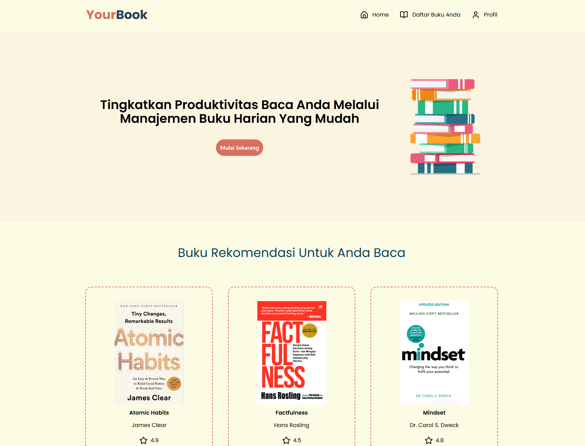
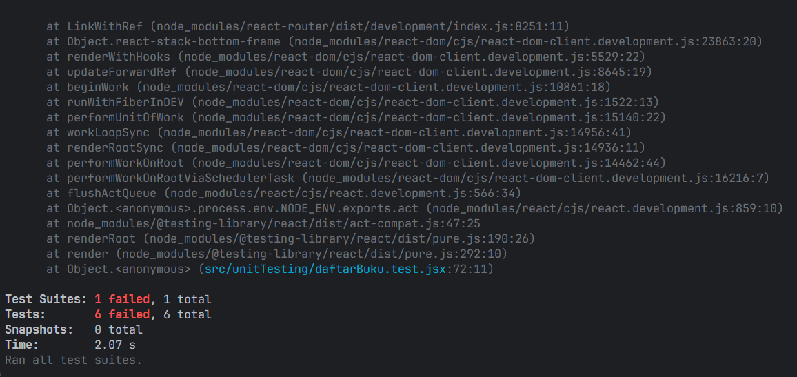

<!-- ABOUT THE PROJECT -->

## About The Project



Website YourBook adalah sebuah web app yang bertujuan memudahkan pengguna dalam melakukan manajemen buku bacaan harian mereka. Website ini dibangun menggunakan library javascript populer yakni ReactJS.

Fitur-fitur dalam aplikasi YourBook ini antara lain :

- Menambahkan buku bacaan baru beserta statusnya
- Mengelola buku-buku yang telah pengguna tambahkan
- Menampilkan buku-buku sesuai dengan keinginan pengguna

### Instalasi

1. Clone repository
   ```sh
   git clone https://github.com/mustafamadjid/pemrograman_web_itera_122140191.git
   ```
2. Install NPM packages menggunakan perintah di bawah ini
   ```sh
   npm install
   ```
3. Ubah git remote url untuk menghindari push yang tidak disengaja ke repository ini
   ```sh
   git remote set-url origin github_username/repo_name
   git remote -v
   ```
4. Jalankan website
   ```sh
   npm run dev
   ```

<!-- GETTING STARTED -->

## Fitur ReactJS yang Diaplikasikan Dalam Aplikasi Web

- useState
- useEffect
- Context API
- Props

## Screenshot Unit Testing



Athaullah Mustafa Madjid
Teknik Informatika ITERA


